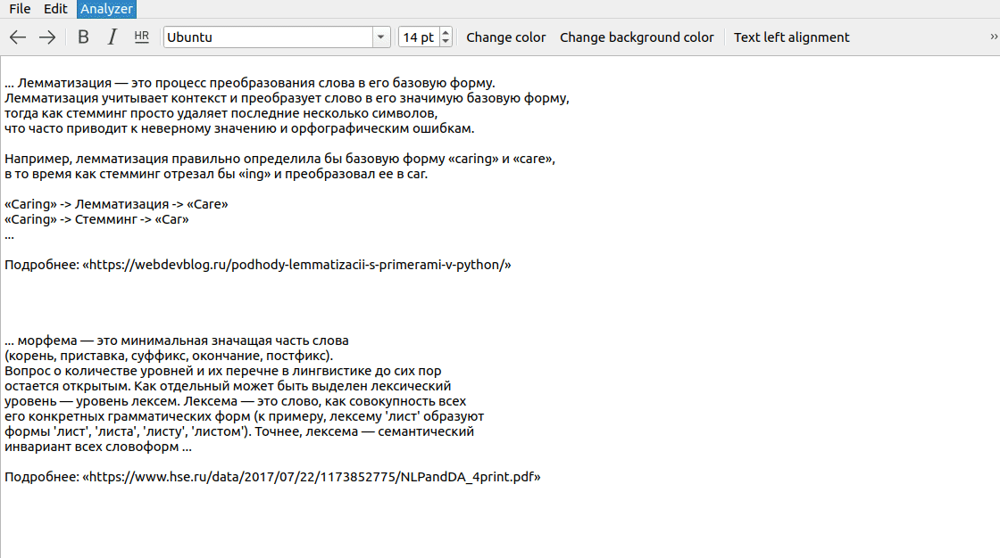
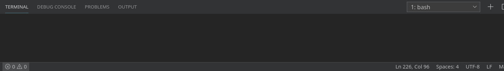
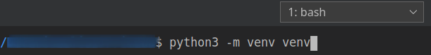
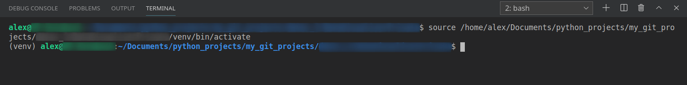
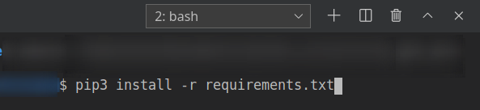

# Simple-Text-Analyzer-Template

This is a small cross-platform project to visualize results of nlp using Natasha and PyQt5.

The source code shows how to process Russian language and highlight words by different colors by clusters of parts of speech.

Feel free to use this as a template for any text-processing tasks.


# What are the key features of this project?

1. The app highlights verbs in Russian so **this project helps to focus on important actions in sentences.** It makes easy to read complex texts, which require to focus on verbs (e.g. license agreements, different documents, etc)


2. Another purpose is to create **a flexible platform (a template)** and to be able to expand it later with different nlp libraries, so, this repo provides a source code, which can be used in other language-processing projects. 

3. **This repo may help others**: this particular app shows ways of some basic usage of nlp library called 'Natasha' (https://github.com/natasha/natasha). In addition, it contains examples of basic PyQt5 usage that may help other developers.


# NLP visualization

The application analyzes Russian texts and highlights groups of words with color depending on the parts of speech.

But if You use too many highlighted words, You may lose the meaning of what You are reading.

Nevertheless, You may change parts in the source code by uncommenting segments of other parts of speech:

-  `[yellow]: 'Noun' (существительное)`

-  `[light blue]: 'Particle' (частица)`

-  `[orange]: 'Conjunction' (союз)`

-  `[red]: 'Pronoun' (местоимение)`

-  `[light green]: 'Verb' (глагол)`

There are a few mistakes in definition of parts of speech, but it is still a very powerful library that could be improved over time.

So You can get the following results:




# What are the parts of this repo?

### Cross-platform interface

This app has a text editor with some basic actions based on PyQt5:

- to open a text file

- to copy/paste clipboard data

- to undo/redo actions

- to choose styles: align the text, choose background and foreground colors, etc

### NLP with 'Natasha'

'Natasha' makes possible to process Russian language in real time by using 'morph_tagger' and 'segmenter' to cluster words by their parts of speech. Check out the source code for more info: https://github.com/natasha/natasha/blob/master/natasha/morph/vocab.py


# How to run the code

The following steps assume using VS Code. 

Open a terminal:



Create a virtual environment called 'venv':



```
python3 -m venv venv
```

Select 'venv' for the workspace folder by clicking 'Yes':


Activate Your 'venv' or simply open a new terminal in VS Code by clicking "Plus" symbol (near 'bash'), it will auto-activate it:



Install the requirements:



```
pip install -r requirements.txt
```

Run the code:

```
python3 main.py
```

The following steps are quite simple:

1. open a text file or just copy/paste any Russian text
2. click 'Analyzer' -> 'Analyze and highlight'
3. wait for results


# Interesting facts

That technique -to highlight different parts of speech for better understanding- was used by Robert Somervell (1851 – 1933), a man who taught Winston Churchill. Source where I found out about it: https://habr.com/ru/company/englishdom/blog/504572

There is a phrase from "My Early Life. A Roving Commission", written by Winston Churchill: 

```
... I continued in this unpretentious situation for nearly a year. However, by being so long in the lowest form I gained
an immense advantage over the cleverer boys. They all went on to learn Latin and Greek and splendid things like that.
But I was taught English. We were considered such dunces that we could learn only English. Mr. Somervell—a most
delightful man, to whom my debt is great—was charged with the duty of teaching the stupidest boys the most disregarded
thing—namely, to write mere English. He knew how to do it. He taught it as no one else has ever taught it. Not only did
we learn English parsing thoroughly, but we also practised continually English analysis. Mr. Somervell had a system of
his own. He took a fairly long sentence and broke it up into its components by means of black, red, blue and green inks.
Subject, verb, object: Relative Clauses, Conditional Clauses, Conjunctive and Disjunctive Clauses! Each had its colour
and its bracket. It was a kind of drill. We did it almost daily. As I remained in the Third Fourth ([Greek: beta]) three
times as long as anyone else, I had three times as much of it. I learned it thoroughly. Thus I got into my bones the
essential structure of the ordinary British sentence—which is a noble thing. And when in after years my schoolfellows
who had won prizes and distinction for writing such beautiful Latin poetry and pithy Greek epigrams had to come down
again to common English, to earn their living or make their way, I did not feel myself at any disadvantage. Naturally 
I am biassed in favour of boys learning English. I would make them all learn English: and then I would let the clever 
ones learn Latin as an honour, and Greek as a treat. ... 
```


## Rate this project! :star:
### If You liked this repo, give it a star. Thanks!


